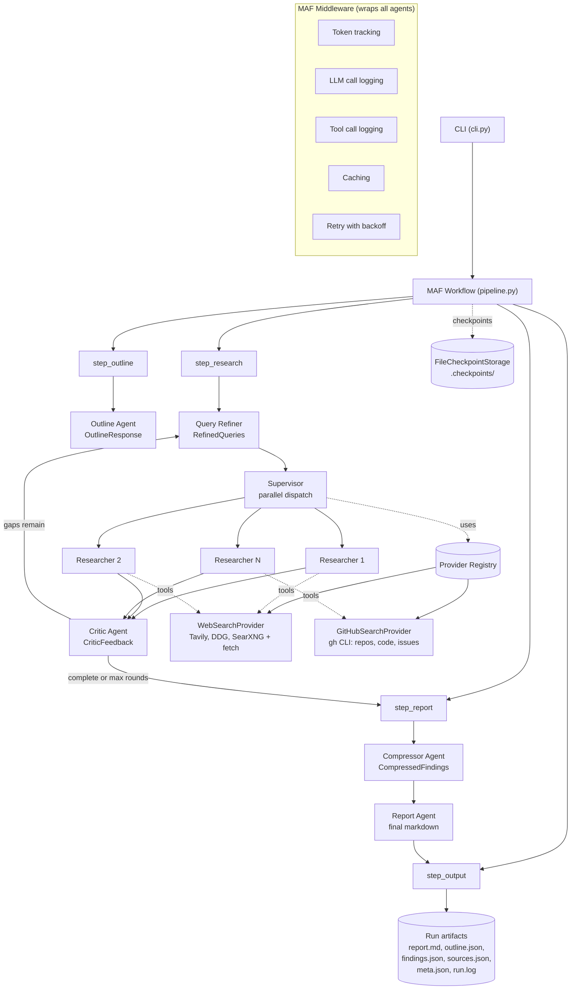

# Deep Research Agent

Multi-round iterative research agent powered by [Microsoft Agent Framework (MAF)](https://github.com/microsoft/agent-framework).
Supports web search, GitHub search, and combined modes with pluggable search providers, structured outputs, parallel research dispatch, and checkpointed workflows.

## How it works

```
Query
  │
  ▼
OutlineAgent ──► QueryRefiner ──► Supervisor (parallel) ──► CriticAgent
                                          │                       │
                                          └────── loop until ─────┘
                                                 complete or max rounds
                                                        │
                                                        ▼
                                          CompressorAgent ──► ReportAgent ──► Output
```

1. **Outline Agent** — generates a structured research plan (topics + subtopics) using MAF structured outputs.
2. **Query Refiner** — turns each topic / gap into focused search queries (deduplicated, capped per round).
3. **Supervisor** — fans queries out across registered `SearchProvider`s and runs researchers in parallel with isolated agent contexts (semaphore-bounded concurrency).
4. **Critic Agent** — scores completeness and lists knowledge gaps; loop ends when complete or `--max-rounds` reached.
5. **Compressor Agent** — deduplicates and merges findings, preserving citations and producing cross-cutting notes.
6. **Report Agent** — compiles the final markdown report with sources.
7. **Output step** — writes `report.md`, `outline.json`, `findings.json`, `sources.json`, and `meta.json` (token usage, timings) to the run directory.

All agents that return structured data use MAF's native `response_format` with Pydantic models — no manual JSON parsing.

## Architecture



### Search Providers

Research sources are pluggable via the `SearchProvider` protocol. Each provider supplies its own MAF `@tool` functions and instructions:

```python
from deep_research.tools.registry import register

class MyProvider:
    name = "my-source"
    instructions = "How to use these tools..."
    tools = [my_search_tool, my_read_tool]

register(MyProvider())
```

Built-in providers (auto-registered on `deep_research.tools` import):
- **`WebSearchProvider`** — Tavily → DuckDuckGo → SearXNG fallback chain + page fetching (`web_search`, `fetch_page`).
- **`GitHubSearchProvider`** — GitHub repos / code / issues search via `gh` CLI (`github_search`, `github_read`).

`--source both` dispatches to every registered provider.

### Structured Outputs

Agents that return structured data use MAF's `response_format` with Pydantic models defined in [deep_research/models/state.py](deep_research/models/state.py):
- `OutlineResponse` — research topics with subtopics
- `RefinedQueries` — optimized search queries
- `CriticFeedback` — `quality_score`, `gaps`, `complete`
- `CompressedFindings` — deduplicated findings + cross-cutting notes
- `Finding`, `Source`, `Citation` — core data shapes

### Middleware

All agent calls go through composable MAF middleware ([deep_research/middleware.py](deep_research/middleware.py)):
- **Token tracking** — cumulative prompt / completion / total tokens, written to `meta.json`.
- **LLM call logging** — round-trip timing and message counts.
- **Tool call logging** — per-tool timing and result sizes.
- **Caching** — deduplicates identical tool calls within a run.
- **Retry** — automatic retry with exponential backoff on transient failures.

### Workflow & Checkpointing

The pipeline uses MAF's `@workflow` / `@step` decorators with `FileCheckpointStorage` ([deep_research/workflow/pipeline.py](deep_research/workflow/pipeline.py)). Checkpoints are written to `<research_dir>/.checkpoints/` for every run. (`--resume` is wired into the CLI but not yet implemented.)

## Setup

```bash
uv sync
```

Create a `.env` file with your Azure OpenAI credentials:

```env
AZURE_API_KEY=your-key-here
OPENAI_BASE_URL=https://your-endpoint.openai.azure.com/v1
```

Optional search-provider keys:

```env
TAVILY_API_KEY=...       # Tavily web search (preferred fallback #1)
SEARXNG_URL=...          # Self-hosted SearXNG instance (fallback #3)
```

For GitHub research, install and authenticate the [GitHub CLI](https://cli.github.com/):

```bash
gh auth login
```

## Usage

```bash
# Web research (default)
uv run deep-research 'How to create deep research' --max-rounds 3 -o report.md

# GitHub-focused research
uv run deep-research 'React state management libraries' --source github

# Combined web + GitHub research
uv run deep-research 'Building RAG pipelines' --source both

# Custom output location
uv run deep-research 'Rust async patterns' -o reports/rust-async.md --research-dir reports
```

### Options

| Flag | Default | Description |
|------|---------|-------------|
| `--max-rounds` | `3` | Maximum research iterations |
| `-o, --output` | `report.md` | Output file path for the final report |
| `--source` | `web` | Research source: `web`, `github`, or `both` |
| `--research-dir` | `reports` | Base directory for research artifacts |
| `--resume` | — | Path to a previous research dir (not yet implemented) |

### Run artifacts

Every run creates a directory under `--research-dir` named `YYYY-MM-DD-<slugified-query>/` containing:

```
report.md           # Final markdown report (also copied to -o path)
outline.json        # Outline returned by OutlineAgent
findings.json       # Findings grouped by round
sources.json        # Deduplicated sources with metadata
meta.json           # Query, timings, counts, token usage
run.log             # Full structured log for the run
.checkpoints/       # MAF FileCheckpointStorage state
```

## Project Structure

```
deep_research/
  cli.py                  # Click CLI entry point
  client.py               # Azure OpenAI chat client factory
  config.py               # Pydantic settings loaded from .env
  log.py                  # Colored logger + per-run file handler
  middleware.py           # Token tracking, caching, retry, logging middlewares
  utils.py                # Slugify, URL extraction, file I/O helpers
  models/
    state.py              # ResearchTopic, Finding, Source, Citation, CriticFeedback, etc.
  agents/
    outline.py            # Outline generation (structured output)
    query_refiner.py      # Search query optimization (structured output)
    supervisor.py         # Parallel research dispatch via the provider registry
    critic.py             # Research quality + gap evaluation (structured output)
    compressor.py         # Findings deduplication and merging (structured output)
    report.py             # Final report compilation
  tools/
    provider.py           # SearchProvider protocol + WebSearchProvider, GitHubSearchProvider
    registry.py           # Provider registry (register / get_providers)
    search.py             # Web search: Tavily → DuckDuckGo → SearXNG
    fetch.py              # Web page fetcher (httpx + trafilatura)
    extract.py            # Full-article text extractor (trafilatura)
    github_search.py      # GitHub repos / code / issues search via `gh`
    github_read.py        # GitHub file reader via `gh`
    github_trending.py    # GitHub trending repositories (auxiliary)
    hackernews.py         # Hacker News fetcher (auxiliary)
    reddit.py             # Reddit fetcher (auxiliary)
    rss.py                # RSS / Atom feed fetcher (auxiliary)
  workflow/
    pipeline.py           # MAF @workflow / @step + run_research()
    pipeline_steps.py     # Step bodies: outline, research round, report, output
```

> Auxiliary tools (`extract`, `github_trending`, `hackernews`, `reddit`, `rss`) are available for custom providers but are not registered by default.

## Tech Stack

- Python 3.12, [uv](https://docs.astral.sh/uv/) package manager
- [Microsoft Agent Framework](https://github.com/microsoft/agent-framework) 1.2.0+ (workflows, agents, middleware, checkpointing)
- `agent-framework-openai` — Azure OpenAI chat client
- Azure OpenAI (default model: `gpt-5.5`)
- Pydantic v2 + `pydantic-settings`
- Click for the CLI
- `httpx`, `trafilatura`, `ddgs`, optional `tavily-python`
- GitHub CLI (`gh`) for the GitHub provider
